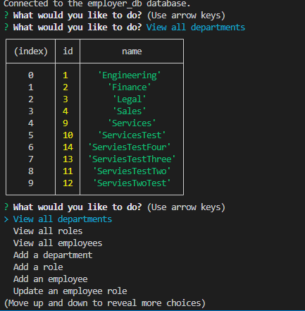

# EMPLOYEE TRACKER

This is a node CLI application that uses CRUD and MySql to keep track of employees in a database!

[Video of app execution](https://drive.google.com/file/d/1Bp6PdhPbRMGr1N3-4maubxpDYyOkNU_p/view)

## Description

In this employee-tracker application, the user will be prompted in the CLI and depending  
on the answers given, database information will be returned in the form of tables.

### Installing

To install dependencies, simply run the command 'npm i'.

### Executing program

To execute the program run the command, 'npm start'.

### Testing

No testing currently available.

## Authors

Dylan Crowley:

[Github](https://github.com/dcrowdev)  
[Twitter](https://twitter.com/dcrowdev)  
[LinkedIn](https://www.linkedin.com/in/dylan-crowley-3974b8252/)  
dcrowdev1025@gmail.com

## License

This project is licensed under the MIT license.

## Acknowledgments

UCF Fullstack bootcamp!